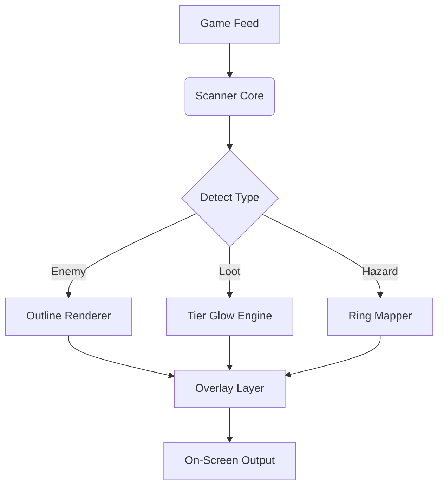

## 🌌 Overview

Warborne Above Ashes blends fast combat, dense vertical arenas, faction skirmishes, and shifting elemental hazards.
This cheat suite provides **client-side clarity tools**, movement refinements, and visual enhancements that make the world feel readable—
not easier, just **sharper**.

What you gain:

* stable combat handling
* clean threat detection
* resource & loot visibility
* improved traversal feel
* customizable HUD clarity
* profile-based tuning

Everything modular.
Everything adjustable to your playstyle.

---

## ⚔ Feature Suite

### 🎯 Combat Precision & Aim Enhancements

* **Recoil Drift Controller**
  Softens vertical recoil for ranged classes.
* **Element-Focused Target Outline**
  Distinct colors for fire, frost, and arcane-infused foes.
* **ADS Entry Smoother**
  Reduces micro-stutter entering aim mode.
* **Weakpoint Flash Assist**
  Subtle cue when crosshair aligns with a breakable spot.

### 👁 Enemy, Loot & World Vision

* **Enemy ESP Silhouettes**
  Soft, class-coded outlines through smoke, embers, or dust storms.
* **Loot Tier Glow System**
  Colour halos for Common → Relic-tier gear.
* **Skill Resource Highlighting**
  Marks runestones, catalysts, or class-ability pickups.
* **Environmental Hazard Rings**
  Displays AoE of molten cracks, frost bursts, or arcane eruptions.

### 🚶 Traversal & Movement Modifiers

* **Sprint Momentum Tuner**
  Smooths terrain transitions and diagonal strafing.
* **Jump Arc Controller**
  Improves consistency in vertical combat arenas.
* **Camera Sway Softener**
  Reduces harsh shake from explosions or heavy landings.

### 🧭 Tactical Awareness Systems

* **Threat Direction Radar**
  Indicates shot vectors, spell cast origins, or stealth flanks.
* **Objective Beaconing**
  Clean indicators for faction points, siege nodes, or ritual sites.
* **Rotation Path Tracer**
  Suggests efficient combat or escape routes through multi-level areas.

### ⚙ System, Profiles & QoL

* **Performance-Friendly Overlay Engine**
  Quick and stable even in dense VFX arenas.
* **Profile Manager**
  Save builds: Duelist / AOE Mage / Scout / Loot Runner / Boss Study.
* **Hot-Reload Settings**
  Adjust everything mid-combat—no restart.

---


---

## ⚡ Setup

1. Download the **Warborne Above Ashes Cheats** archive
2. Extract to a new tools folder
3. Run `Warborne-CheatSuite.exe` as Administrator
4. Launch **Warborne Above Ashes**
5. Press **F6** to open the Cheat Dashboard
6. Enable modules & tune your combat style

---

## 🔧 Sample Configurations

### JSON — “Elemental Archer Build”

```json
{
  "recoilControl": 0.22,
  "elementOutline": "frost-blue",
  "lootGlow": "relic-priority",
  "hazardRings": true,
  "jumpArc": 0.18
}
```

### INI — “Ash-Runner Mobility Set”

```ini
sprint_curve=1.16
camera_sway=0
enemy_silhouette=1
loot_filter_epic=1
threat_radar=1
overlay_refresh_ms=60
```

[!IMPORTANT]
Disable *Motion Blur*, *Chromatic Aberration*, and reduce *Particle Density* for clean, unobstructed ESP visibility.

---

## 🧠 Mermaid Diagram: Cheat Logic Flow



Efficient, reactive, and built for high-action encounters.

---

## 🔥 Feature Spotlight: Element-Focused Target Outlines

Warborne’s enemies wield elemental energy—
molten fire bites, frost shatters, arcane storms distort vision.

This feature gives each type its own visual signature:

* fire → ember-red
* frost → icy-blue
* arcane → violet pulse

A world of magic becomes instantly readable,
giving you the clarity to respond before the damage lands.

---

## ❓ FAQ

### Does this affect damage, loot rates, or skill cooldowns?

No—strictly client-side visuals & handling refinement.

### Visible to other players?

Never. Only your client renders enhancements.

### FPS cost?

Around 2–5%, depending on VFX density and silhouettes.

### Controller support?

Yes—tracking, movement & recoil tuning adapt to analog input.

### Independent modules?

Absolutely. Use only what you want.

### Shareable profiles?

Yes—JSON & INI supported.

---

## 🌋 Final Thoughts

Warborne Above Ashes is forged from flame, ruin, and relentless momentum—
a world where every duel feels like a poem written in sparks.

The **Cheat Suite** does not break that poetry.
It clarifies it.
It sharpens your instincts.
It lets you read the battlefield the way a veteran would.

May your arrows fly true,
your rotations swift,
and your legend rise from the ashes, Лорд.

---
